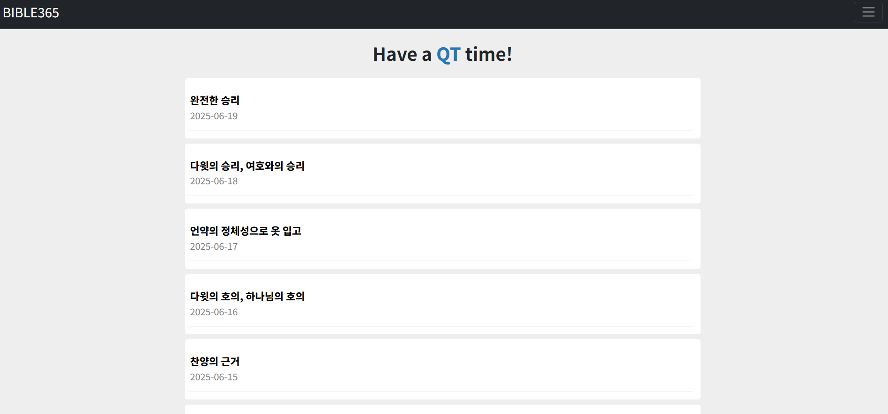
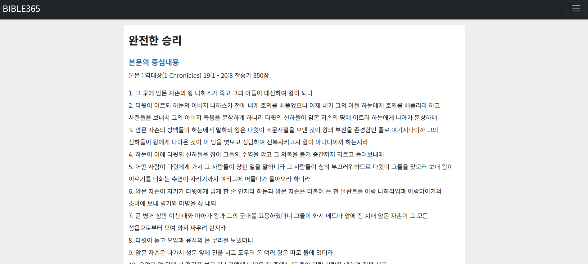
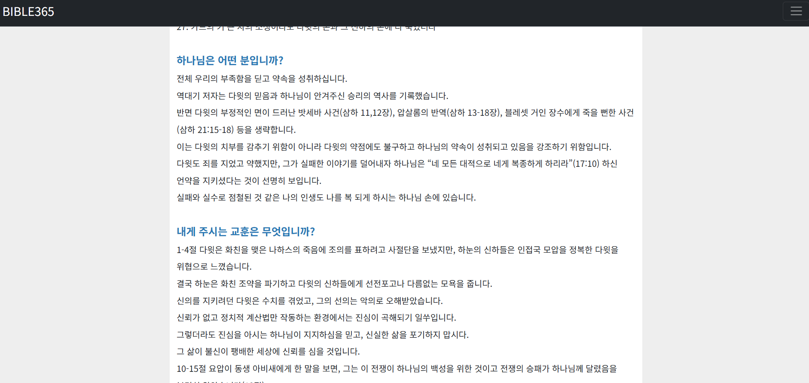
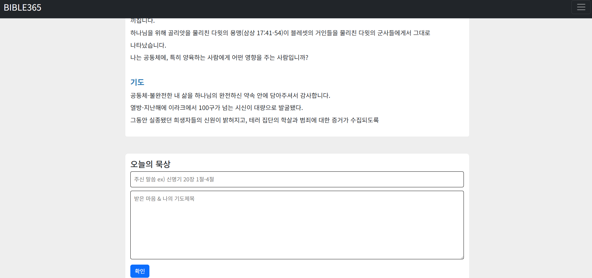

# Bible365

매일 성경 콘텐츠를 자동 수집해 제공하는 웹사이트입니다.  
Raspberry Pi 환경에서 동작하며, node-cron을 이용해 매일 자정에 외부 데이터를 수집합니다.

## 🔧 사용 기술

- Node.js (Express)
- MongoDB
- EJS 템플릿 엔진
- Raspberry Pi
- Axios + Cheerio (크롤링)
- node-cron (스케줄링)

## 📌 주요 기능

- 매일 자정 자동 크롤링 및 데이터 저장
- 날짜별 성경 콘텐츠 웹 페이지 표시
- 반응형 UI 제공

## 🖥️ 실행 방법

1. 저장소를 클론하거나 ZIP으로 다운로드합니다.
2. `.env` 파일에 MongoDB 주소 등 환경변수 설정.
3. 다음 명령어로 서버 실행:

```bash
npm install
nodemon server.js
```
4. 브라우저에서 http://localhost:3000 접속.
5. Raspberry Pi에서 자동 실행을 설정하면 매일 자정 자동 반영됩니다.
6. 아래 제공되는 테스트 아이디와 비밀번호로 로그인.

## 사이트 주소
- 주소: http://bible365.kro.kr
- 테스트ID : test
- password : 12341234

## 🖼️ 스크린샷
## 메인페이지


## 상세페이지1


## 상세페이지2


## 상세페이지3

